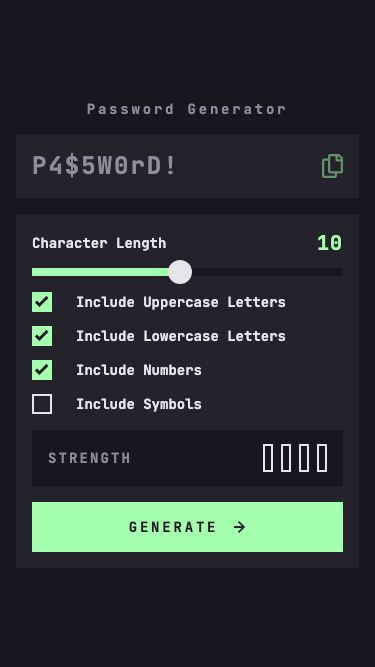
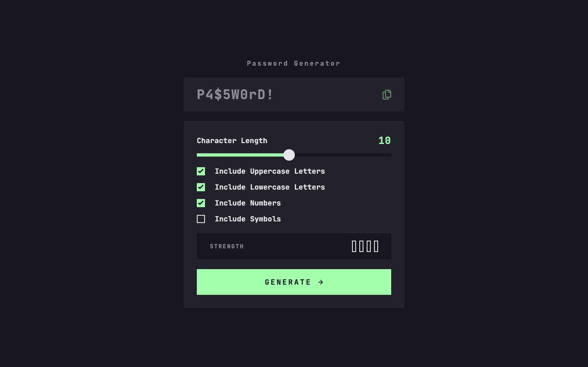

# Frontend Mentor — Password Generator App

A fully accessible, responsive password generator built with React 19 and TypeScript. Users can configure character length and character types, generate a secure password, see its strength rating, and copy it to the clipboard — all from a single polished interface.


## Table of Contents

- [Overview](#overview)
- [Screenshots](#screenshots)
- [Built With](#built-with)
- [What I Learned](#what-i-learned)
- [Project Structure](#project-structure)
- [Getting Started](#getting-started)
- [Roadmap](#roadmap)
- [AI Collaboration](#ai-collaboration)
- [Acknowledgments](#acknowledgments)
- [Author](#author)

---

## Overview

### The Challenge

This is a solution to the [Password Generator App challenge on Frontend Mentor](https://www.frontendmentor.io/challenges/password-generator-app-Mr8CLycqjh).

Users should be able to:

- Generate a password based on selected character-type options (uppercase, lowercase, numbers, symbols)
- Control password length via an interactive range slider (1–20 characters)
- Copy the generated password to the clipboard with one click
- See a real-time strength rating (Too Weak / Weak / Medium / Strong) for the current configuration
- View an optimal layout on any screen size (mobile-first, responsive at 540 px and 1024 px breakpoints)
- See hover, focus, and active states for all interactive elements
- Use the app with a keyboard only (fully accessible form controls and focus management)

### Links

- **Live Site:** [https://fsdev-password-generator-app.vercel.app](https://fsdev-password-generator-app.vercel.app)
- **Solution:** [https://github.com/gusanchefullstack/fsdev-password-generator-app](https://github.com/gusanchefullstack/fsdev-password-generator-app)

---

## Screenshots

### Mobile (375 px)



### Desktop (1440 px)



---

## Built With

| Layer | Technology |
|---|---|
| UI library | [React 19](https://react.dev) |
| Language | [TypeScript 6](https://www.typescriptlang.org/docs/) |
| Build tool | [Vite 8](https://vitejs.dev) |
| Styling | [CSS Modules](https://github.com/css-modules/css-modules) + CSS custom properties |
| Layout | Flexbox, mobile-first responsive design |
| Fonts | [JetBrains Mono Variable](https://www.jetbrains.com/legalnotice/jetbrainsmono/) (self-hosted) |
| Deployment | [Vercel](https://vercel.com) |

---

## What I Learned

### Fisher-Yates Shuffle with Guaranteed Character Inclusion

A naive random password can fail to include characters from every selected set. The solution guarantees at least one character per active set, then fills remaining slots randomly, then shuffles the entire array:

```ts
const safeGuaranteed = guaranteedChars.slice(0, length); // clamp to requested length
const remaining = length - safeGuaranteed.length;
const randomChars = Array.from({ length: remaining }, () =>
  charset[Math.floor(Math.random() * charset.length)]
);
const allChars = [...safeGuaranteed, ...randomChars];
// Fisher-Yates shuffle
for (let i = allChars.length - 1; i > 0; i--) {
  const j = Math.floor(Math.random() * (i + 1));
  [allChars[i], allChars[j]] = [allChars[j], allChars[i]];
}
```

Key insight: slicing `guaranteedChars` to `length` prevents the output from exceeding the requested character count when length < number of active sets.

### Dynamic CSS Custom Properties via `createPortal`

Styling a range slider's fill requires a dynamic CSS custom property (`--fill-percent`). Inline styles are an accessibility anti-pattern; injecting a `<style>` tag inside a sectioning element is an HTML error. The fix uses `useId()` for a unique scope class and `createPortal` to place the `<style>` tag in `<head>`:

```tsx
const uid = useId();
const scopeClass = `slider-${uid.replace(/:/g, '')}`;

return (
  <>
    {createPortal(
      <style>{`.${scopeClass}{--fill-percent:${percentage}%}`}</style>,
      document.head
    )}
    <div className={`${styles.container} ${scopeClass}`}>
      ...
    </div>
  </>
);
```

This satisfies the HTML validator, avoids inline `style` attributes, and keeps the CSS variable scoped to the specific slider instance.

### Accessible Semantics: `<output>` and `<form>`

The generated password field uses `<output>` (not `<p>` or `<div>`), which:
- Has implicit ARIA role `status` for live region announcements
- Accepts a `for` attribute linking it to the form controls that computed it
- Is keyboard-focusable with `tabIndex={0}`

Grouping all controls in a `<form>` with `onSubmit` means the Generate button works as `type="submit"`, enabling the Enter key to trigger generation natively without extra JavaScript event wiring.

### Lifting IDs for Correct `<output for>` Association

When `useId()` generates a dynamic ID inside `CharacterLengthSlider`, the `<output>`'s `for` attribute in `PasswordDisplay` would be stale if each component generated its own ID independently. The solution lifts ID generation to `App.tsx` and passes the ID as a prop to both components:

```tsx
// App.tsx
const sliderId = useId();
const sliderInputId = `char-length-${sliderId.replace(/:/g, '')}`;

<CharacterLengthSlider inputId={sliderInputId} ... />
<PasswordDisplay sliderInputId={sliderInputId} ... />
```

### Responsive Design Without `px` in Media Queries

All breakpoints use `em` units so they respect the user's browser font-size preference:

```css
/* 540px ÷ 16 = 33.75em */
@media (min-width: 33.75em) { ... }

/* 1024px ÷ 16 = 64em */
@media (min-width: 64em) { ... }
```

### Useful Resources

- [MDN — `<output>` element](https://developer.mozilla.org/en-US/docs/Web/HTML/Element/output)
- [MDN — `prefers-reduced-motion`](https://developer.mozilla.org/en-US/docs/Web/CSS/@media/prefers-reduced-motion)
- [CSS Tricks — Custom range slider styling](https://css-tricks.com/styling-cross-browser-compatible-range-inputs-css/)
- [WCAG 2.1 — Understanding SC 1.4.3 Contrast (Minimum)](https://www.w3.org/WAI/WCAG21/Understanding/contrast-minimum.html)
- [Fisher-Yates Shuffle — Wikipedia](https://en.wikipedia.org/wiki/Fisher%E2%80%93Yates_shuffle)

---

## Project Structure

```
src/
├── components/
│   ├── CharacterLengthSlider/  # Range slider with dynamic fill via CSS custom property
│   ├── GenerateButton/         # Submit button that triggers the parent form
│   ├── OptionCheckbox/         # Accessible custom checkbox for each character type
│   ├── PasswordDisplay/        # <output> element with copy-to-clipboard action
│   └── StrengthMeter/          # Visual bar-chart strength indicator
├── hooks/
│   └── usePasswordGenerator.ts # Core state: password, options, strength, clipboard
├── styles/
│   ├── global.css              # Reset, body, sr-only, focus-visible
│   ├── tokens.css              # CSS custom properties (colors, typography, spacing)
│   └── responsive.css          # App-level layout at breakpoints
├── App.tsx                     # Composition root, ID lifting, form wiring
└── main.tsx                    # React DOM entry point
```

---

## Getting Started

**Prerequisites:** Node.js ≥ 18

```bash
# Clone
git clone https://github.com/gusanchefullstack/fsdev-password-generator-app.git
cd fsdev-password-generator-app

# Install
npm install

# Develop
npm run dev          # Vite dev server → http://localhost:5173

# Build
npm run build        # TypeScript check + Vite production build → dist/

# Preview production build
npm run preview
```

No environment variables required — the app is entirely client-side.

---

## Roadmap

- [x] Password generation with guaranteed character inclusion
- [x] Fisher-Yates shuffle for uniform randomness
- [x] Real-time strength meter (4 levels)
- [x] Copy to clipboard (Clipboard API + `execCommand` fallback)
- [x] Accessible range slider with dynamic CSS fill
- [x] Responsive layout (mobile / tablet / desktop)
- [x] Full keyboard navigation and screen-reader support
- [x] Reduced-motion support (`prefers-reduced-motion`)
- [x] Deployed to Vercel
- [ ] Exclude ambiguous characters option (e.g., `0`, `O`, `l`, `1`)
- [ ] Password history (last 5 generated)
- [ ] Entropy calculation displayed alongside strength

---

## AI Collaboration

This project was built in collaboration with **Claude Code (claude-sonnet-4-6)** via the Anthropic CLI.

**How AI was used:**
- Scaffolding the Vite + React + TypeScript project structure and component architecture
- Implementing the Fisher-Yates shuffle with guaranteed character inclusion logic
- Solving the dynamic CSS custom property problem (`createPortal` + `useId()` approach)
- Iteratively fixing accessibility, HTML, CSS, and JavaScript issues flagged by the Frontend Mentor quality report (score improved to **8.8/10 Exceptional**)
- Writing semantic HTML (`<output>`, `<form>`, `<fieldset>`, `<legend>`) and scoped focus styles

**What worked well:** Using Claude to reason through non-obvious patterns (like lifting IDs for `<output for>` correctness) and to cross-reference WCAG contrast ratios.

**What required human judgment:** Deciding which linter warnings were false positives (e.g., `prefers-reduced-motion: no-preference` pattern, root-relative asset paths on a root-deployed app) vs. genuinely worth fixing.

---

## Acknowledgments

- [Frontend Mentor](https://www.frontendmentor.io) for the challenge design and quality report tooling
- [JetBrains](https://www.jetbrains.com) for the open-source JetBrains Mono variable font
- The WCAG working group for clear contrast-ratio guidance

---

## Author

**Gustavo Sanchez**

[](https://www.linkedin.com/in/gustavosanchezgalarza/)
[](https://github.com/gusanchefullstack)
[](https://hashnode.com/@gusanchedev)
[](https://x.com/gusanchedev)
[](https://bsky.app/profile/gusanchedev.bsky.social)
[](https://www.freecodecamp.org/gusanchedev)
[](https://www.frontendmentor.io/profile/gusanchefullstack)
